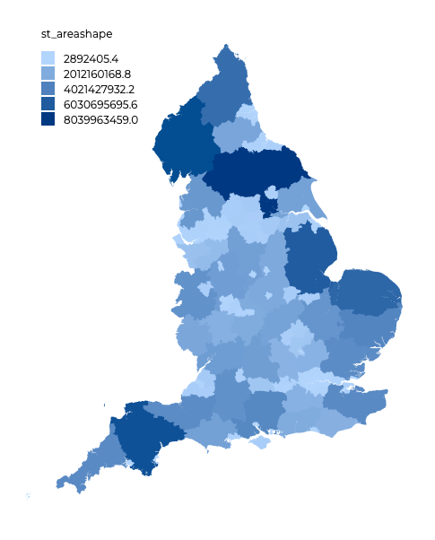

# choromap-lite

A lite version of choromap. Takes an input of a GeoJSON file in STYLE tab and joins with data in DATA tab.



## Data

In the DATA tab populate the Dimension field with the ID of the data you want to join to the polygons. Then the Metric is what you want to show related to the polygon.

In the STYLE tab, in `Input GeoJSON` input the GeoJSON file, e.g.

```txt
{
"type": "FeatureCollection",
"name": "utla_uk_2019_bgc",
"crs": { "type": "name", "properties": { "name": "urn:ogc:def:crs:OGC:1.3:CRS84" } },
"features": [
{ "type": "Feature", "properties": { "objectid": 1, "ctyua19cd": "E06000001", "ctyua19nm": "Hartlepool", "ctyua19nmw": null }, "geometry": { "type": "MultiPolygon", "coordinates": [ [ [ [ -1.24097984294886, 54.723183493277659 ], [ -1.176154551853605, 54.697675590632898 ], [ -1.173979715641095, 54.691810535033106 ], [ -1.196240961710026, 54.698572873239343 ], [ -1.188027070515213, 54.693350750135806 ], [ -1.199092276155691, 54.680575316590208 ], [ -1.175868906270257, 54.653409351351932 ], [ -1.157622586772996, 54.648194817334229 ], [ -1.173151655989613, 54.633703854281833 ], [ -1.188235396549023, 54.632592966449621 ], [ -1.200638130907635, 54.622932365213501 ], [ -1.250691663237776, 54.625307283758019 ], [ -1.298999443949639, 54.627970223416497 ], [ -1.316349739952518, 54.645223613452174 ], [ -1.328849151830261, 54.643990402788916 ], [ -1.335046640018955, 54.631312563742533 ], [ -1.380884808515404, 54.643906176244414 ], [ -1.341239877510387, 54.65020087677869 ], [ -1.347837230478313, 54.662410178234538 ], [ -1.330931723355795, 54.682123236758095 ], [ -1.344511827799231, 54.691110601630001 ], [ -1.319315344865701, 54.691346496572216 ], [ -1.301312636384319, 54.708090819348328 ], [ -1.305506733350906, 54.717511426512488 ], [ -1.270237362394558, 54.72715842720914 ], [ -1.251850459770516, 54.719612482310652 ], [ -1.24097984294886, 54.723183493277659 ] ] ] ] } }...
```

Then in `ID of GeoJSON features` type the ID of the features. Above this would be `ctyua19cd`.

## D3 code

We created our code using a mash of approaches largely from [Most basic choropleth map in d3.js
](https://www.d3-graph-gallery.com/graph/choropleth_basic.html), [Choropleth map with hover effect in d3.js
](https://www.d3-graph-gallery.com/graph/choropleth_hover_effect.html), [Observable's Choropleth Guide](https://observablehq.com/@d3/choropleth) as well as countless StackOverflow answers.

We also largely followed the [Create Custom Javascript Visualizations in Data Studio Codelab guide](https://codelabs.developers.google.com/codelabs/community-visualization/#0).

The `src` folder comprises the four important files for Data Studio:

- choromap.css (any css to make things look nice)
- choromap.js (the bulk of the code)
- choromap.json (all the parts needed for customisation in Data Studio)
- manifest.json (all information for the community visualisation tool)

`choromap.js` uses a lot of pre-existing D3 libraries, such as the tool-tip and legend libraries. In a nutshell it gets all the config information from the user, creates the SVG, creates a GeoJSON looking-type object from the information it gets (including the STRING geometry field), and then draws the map.

## Using choromap in Data Studio

To use choromap-lite first import it into your Data Studio report:

- Click custom visualisations and components
- Click Explore More
- Click Build your own visualisation
- In the manifest path type `gs://choromap-lite/`

Then add the chart to your report. In the `DATA` tab, for the `Dimensions` make sure this is the ID of the data you want to plot (matches to the geometry polygon in `STYLE` tab). You can then select a `Metric` you want the colormap to plot against. In the sample data this may be st_areashape or st_lengthshape. In the `STYLE` tab you can then customise:

- the minimum value plot colour
- the maximum value plot colour
- the null value plot colour
- the boundary line colour
- the boundary line width
- the text colour
- show or remove the legend
- add a title for the legend

## Contributing and Bugs

See [CONTRIBUTING.md](CONTRIBUTING.md) for guidelines on how to contribute. For all Bugs please raise an Issue ticket.